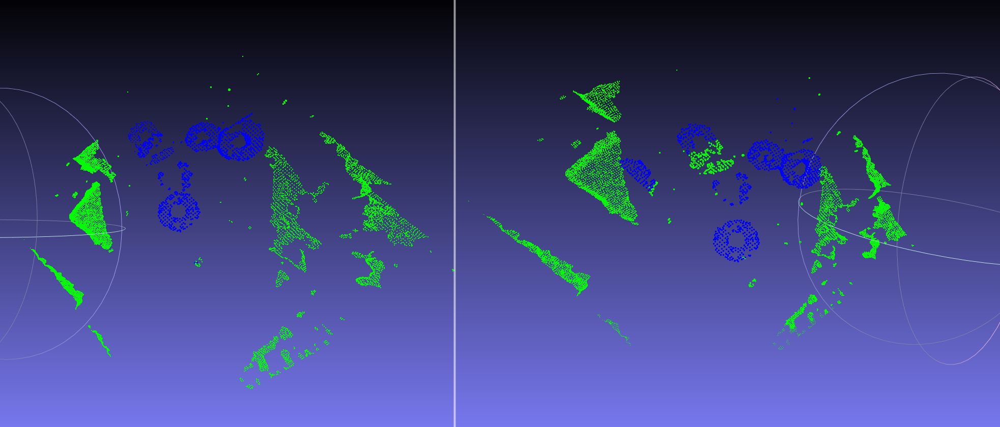
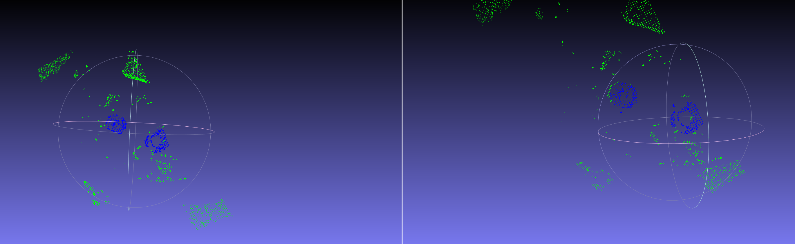
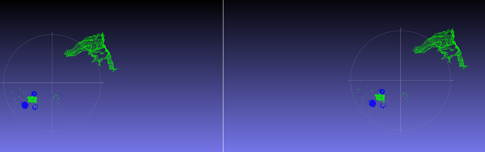
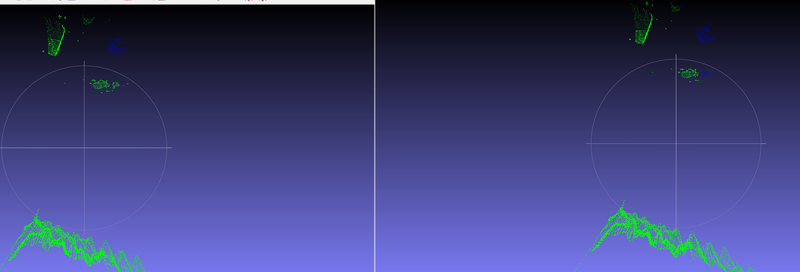
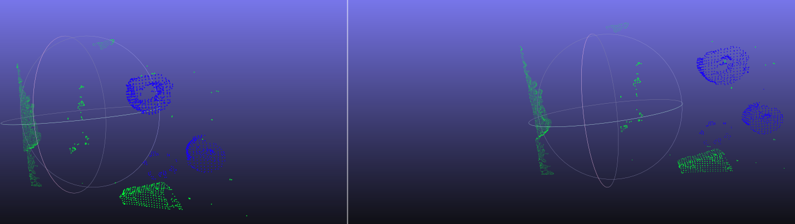

## 3D detecion of custom objects using PointNet
Left: Ground Truth, Right: Predictions



The main code is from <a href="https://github.com/charlesq34/pointnet" target="_blank">PointNet GitHub Repo<a>

The code has been tested under following envoirenment;
* Ubuntu 18.04 LTS
* Python 3.6.9
* Tensorflow 1.14.0
* CUDA 10.0
* Cudnn 7.6.2

There is few dependencies, h5py, open3d, numpy etc. It is suggested to install them via pip3

### Dataset

Bored of seeing same datasets all over the place ? , seriously I am, I encourge you to collect your own data and train on it,  then it starts to feel real. 
So this project uses real data captured from Intel RealSense D435 depth camera. 
Tricky part is; Pointnet can accept number of points as power of 1024. 
So depending on the speed and accuracy that best works for the appliction you aim, 
number of points should be NX1024.

#### If you want to collect your own data:
from a depth camera or anything that provides pointcloud data, I write a detailed tutorial [here](PREPARE_DATA.md) on how to collect, pre-process, label data and finally make it ready for PointNet to consume.

#### if you want to use real data that I collect and labeled :
Download the .h5 file [here](https://drive.google.com/open?id=10CUXVLeIvodVYnCgs1bf1cvz3h2xVdw2). This data consists of 60 frames of labeled point cloud data captured from Realsense D435. Now we can augment this real data with the script "augment_real_data.py".  real_data.h5 file should be under data folder.
this script uses open3d for reading and processing pointcloud data, 
install open3d with;
> pip3 install open3d

and then augment data with; 

> python3 augment_real_data.py

After this command, there should be 6 additional .h5 files under data folder one particularly for testing. Except test.h5, Rename all  files maunally such as; d0.h5, d1.h5 ... ,d5.h5 so that we can iterate through them easily in training part. 

### Training
Training script is a ipython notebook.
After augmentation step we should have total of 6 .h5 data files under data folder.

```cpp
ipython notebook 
```
direct to train.ipynb under root of project directory, 

and run each cell, make sure you dont recieve an error.
The training will hold on According to number of epochs and after each epoch the model will be saved in model.ckpt under log directory.

### Testing
Testing is again done in ipython notebook. direct to test.ipynb under root of project directory,
the test data produced by augmenttaion script is used to test model. test.h5 includes same number of frames as real_data.h5. dependin n the frame you want to test change "frame_to_test" parameter in test.ipynb

For example I got following performance on 56'th frame;
```cpp
eval mean loss: 0.023177
eval accuracy: 0.990967
eval avg class acc: 0.970006
```
test.ipynb will dumb 2 mesh files under log folder, ground truth and prediction, (frame_num)_gt.obj and (frame_num)_pred.obj
### Visualizing results
Using meshlab or another cad software we can visualize the output of network using dumped .obj files under log. Here are some detection results. 
AT left Ground truths and at right predictions.







### Selected Projects that Use PointNet

* <a href="http://stanford.edu/~rqi/pointnet2/" target="_blank">PointNet++: Deep Hierarchical Feature Learning on Point Sets in a Metric Space</a> by Qi et al. (NIPS 2017) A hierarchical feature learning framework on point clouds. The PointNet++ architecture applies PointNet recursively on a nested partitioning of the input point set. It also proposes novel layers for point clouds with non-uniform densities.
* <a href="http://openaccess.thecvf.com/content_ICCV_2017_workshops/papers/w13/Engelmann_Exploring_Spatial_Context_ICCV_2017_paper.pdf" target="_blank">Exploring Spatial Context for 3D Semantic Segmentation of Point Clouds</a> by Engelmann et al. (ICCV 2017 workshop). This work extends PointNet for large-scale scene segmentation.
* <a href="https://arxiv.org/abs/1710.04954" target="_blank">PCPNET: Learning Local Shape Properties from Raw Point Clouds</a> by Guerrero et al. (arXiv). The work adapts PointNet for local geometric properties (e.g. normal and curvature) estimation in noisy point clouds.
* <a href="https://arxiv.org/abs/1711.06396" target="_blank">VoxelNet: End-to-End Learning for Point Cloud Based 3D Object Detection</a> by Zhou et al. from Apple (arXiv) This work studies 3D object detection using LiDAR point clouds. It splits space into voxels, use PointNet to learn local voxel features and then use 3D CNN for region proposal, object classification and 3D bounding box estimation.
* <a href="https://arxiv.org/abs/1711.08488" target="_blank">Frustum PointNets for 3D Object Detection from RGB-D Data</a> by Qi et al. (arXiv) A novel framework for 3D object detection with RGB-D data. The method proposed has achieved first place on KITTI 3D object detection benchmark on all categories (last checked on 11/30/2017).


